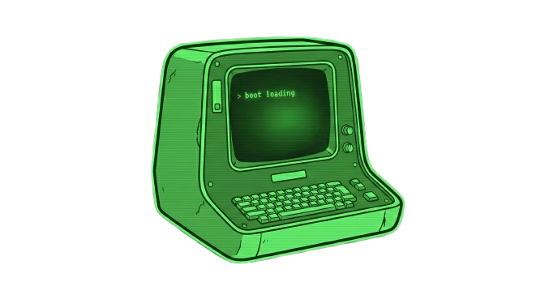

# Papyrus Material Icons

This extension provides **Material Design** style icons for Papyrus language files used in games like Fallout 4 and Skyrim.

It is the perfect visual companion for developers using the [Papyrus Language Support](https://marketplace.visualstudio.com/items?itemName=JoelDay.papyrus-lang) extension. It makes your file explorer easier to read by distinguishing between source and compiled scripts.

## ✨ Features

Adds distinct Material Design icons for the following file extensions:

* **`.psc`** - Papyrus Source Script
* **`.pex`** - Papyrus Compiled Script

## 🎨 Preview
** PSC FILES ICON

** PEX FILES ICON

## 📦 How to Use

1.  Install the extension.
2.  In VS Code, go to **File > Preferences > File Icon Theme**.
3.  Select **"Papyrus Material Icons"** (or the name defined in your package.json) from the list.

## 📋 Requirements

This extension is standalone, but it is highly recommended to use it alongside:
* [Papyrus Language Support](https://marketplace.visualstudio.com/items?itemName=JoelDay.papyrus-lang) (for syntax highlighting)
* [Material Icon Theme](https://marketplace.visualstudio.com/items?itemName=PKief.material-icon-theme) (for a consistent look across all other files)

## 📅 Release Notes

### 1.0.0
* Initial release.
* Added icons for `.psc` and `.pex` files.

---

**Enjoy!** If you like the icons, please leave a review.
